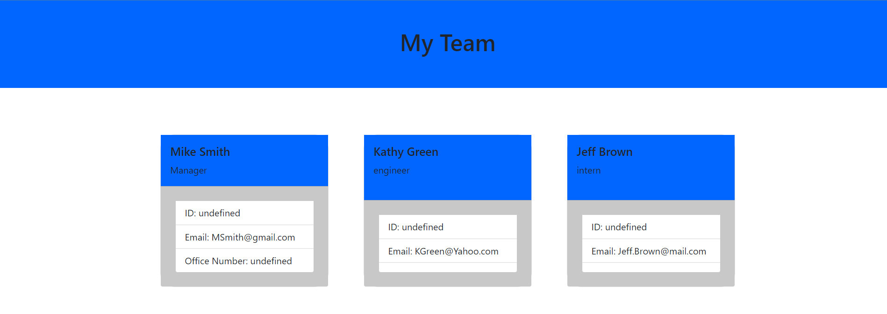

## Description
This project allows for a developer to quickly formulate an html file that include a template for your employee profiles.

## Instructions
To install, clone my repo and then run "npm install inquire" in your terminal.  Next type the command "node index".

Usage
To use this app go to the command line and type "node index". Next answer the prompts in best possible detail. When complete the app will genrate a "index.html" file within the output directory.

## Screenshot

## Demo
https://watch.screencastify.com/v/zkZxPS3MBEvBYNt9HY6g